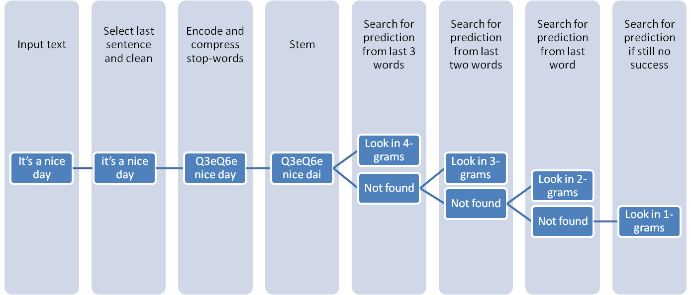

---

#### How the model works

In order to predict next word for our text input, the following __preparation steps__ are done on the input text:

1.  The text input is parsed on sentences

2.  Each sentence is cleaned and split on words (tokenized)

3.  Stopwords are encoded and compressed, so that stowords going in a row would become a virtual word

4.  All words are stemmed

5.  Only the last 3 words(at most) are used for the prediction

__Searching process__ starts with the 

4-grams if the number of words remained on the previous step is 3, 3-grams for 2 words, and 2-grams for 1 word.

4-grams have been used to look for most frequent 4-gram beginning with the last three words.

In no 4-gram found, then 3-grams are used to look for the most frequent 3-gram beginning with the last 2 words.

Again, if no 3-gram found, 2-grams are scanned to look for the most frequent word pair beginning with the last word in our text input.

And finally, if no success, then the search backs off to look for a most frequent single word.

__The predicted word__ is in case of being a stopword is decoded.

---

